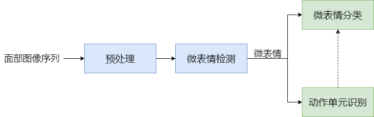

# 表情的分类与定义

人类的面部表情可以分为宏表情（macro-expression）与微表情（micro-expression）两类。其主要区别在于持续时间与作用范围上：1）在持续时间上，宏表情的持续时间长（0.5\~4秒），而微表情的持续时间非常短暂（0.065\~0.5秒），持续过程可以描述为起始点（onset）——顶点（apex）——终止点（offset），由起始点到达顶点的平均时间仅有0.26秒。因此，为了更好地捕捉到微表情的发生，通常使用高速摄像机进行捕捉。2）在作用范围上，宏表情覆盖更大的面部区域，因此会涉及更多的面部肌群，而微表情是局部表情，由一个或少量肌群运动产生。

相较于已有丰富研究成果的宏表情，微表情的研究面临着以下困难：由于微表情时间短、范围小的特点，人们在正常交流中往往难以察觉，需要受过专业训练的专家花费大量时间进行检测与分析，而其正确率也仅有47%\[1]。同时，微表情的更容易受到干扰，如头部移动、眨眼、说话以及光照变化的影响，这使得面向宏表情的相关方法无法直接迁移到微表情问题上直接使用，如宏表情可以从单张图片或是视频中提取，而因为微表情产生面部变化小的特点，其相关研究需要在连续面部图像序列下开展。

# 微表情研究的意义

微表情的产生是在外界刺激和心理神经机制作用下自然产生的属性，属于生理应激反应，是自然发生的，不能被人控制和隐瞒，因而是无法伪造的。这是与表情的最大区别，表情是可以伪装的，但是微表情是基于大脑皮层在受到刺激后最初做出的反应，是不能被伪造的。Ekman等人将不能使用意识进行控制的面部肌肉称为可靠肌肉（reliable muscle），是判断相应表情产生的可靠依据。微表情将在公共服务和医疗健康领域发挥重要作用。在公共服务领域，微表情研究可以用于刑侦测谎，课堂教育以及交流评估；在医疗健康领域，微表情研究可以辅助精神分裂症等精神疾病的治疗与康复。

# 微表情研究的对象

微表情主要研究的内容是微表情检测（spotting）与微表情分类（classification或recognition）任务\[2]。研究问题关系如下图所示：

当获取到面部图像序列时，需要对其进行预处理，如依次进行面部检测、面部特征点定位与面部对齐等。微表情检测任务的目的是将微表情从面部图像序列中与无表情及宏表情区分出来，其主要分为两种，一种是仅检测出微表情在面部图像序列的起始点与终止点，另一种是阶段划分，检测出微表情的起始点、终止点的同时，还需检测出微表情强度最大的顶点，两者的区别如下图所示。微表情的分类任务是在检测到微表情出现的基础上，将其情感状态进行分类，常见的情感状态类别有高兴、愤怒、惊讶、厌恶与恐惧等。

使用动作单元进行微表情分类在心理领域有广泛的应用。Ekman等人提出的面部行为编码系统（facial action coding system, FACS），描绘了不同的脸部肌肉动作和不同表情的对应关系，根据人脸的解剖学特点，将其划分成若干既相互独立又相互联系的运动单元（action unit, AU）。根据动作单元识别的结果，FACS系统可以对微表情进行分类，常见微表情的运动单元如下表： 

| 表情类型 | 主要运动单元                       |
| -------- | ---------------------------------- |
| 高兴     | AU6/ AU12/ AU6+AU12                |
| 惊讶     | AU5/ AU26/ AU1+AU2/ AU18           |
| 愤怒     | AU17+AU13/ AU7/ AU9                |
| 恶心     | AU9/ AU10/ AU4+AU11/ AU14          |
| 恐惧     | AU4+AU5/ AU20/ AU4+AU11/ AU14      |
| 悲伤     | AU14/ AU17/ AU14+AU17/ AU1+AU2     |
| 其它     | AU4/ AU18/ AU4+AU14/ AU38/ AU4+AU7 |

需要补充的是，FACS系统同样可以用于对宏表情的分类，但其主要运动单元的构成与微表情的单元略有不同。

## 研究常用的预处理方法
针对微表情研究的预处理方法除了面部研究常用的面部检测（face detection）、特征点定位（landmark localization）外，主要还需针对微表情时间短、强度低的特点进行处理。
面部检测方法可以分为传统特征提取方法以及深度学习方法。对于传统方法，OpenCV的面部检测采用了基于哈尔特征（haar）及局部二值模式（local binary patterns, LBP）的级联分类器[3][4]；对于深度学习方法，中科院计算所VIPL团队[5]提出了基于逐步矫正网络（progressive calibration networks， PCN），可以有效地对旋转面部进行检测。

使用相关联的多任务模型可以着眼于任务之间的内在联系，使模型具有更好的泛化能力。中国科学院深圳先进技术研究院提出的多任务卷积神经网络（multi-task convolutional neural network, MTCNN）[6]，该模型采用候选框加分类器的思想，使用了三个级联的网络，可以快速高效的人脸检测并定位面部的五个特征点。Ranjan等人[7]建立了基于深度神经网络的多任务模型，在面部检测与特征点定位的同时，进行头部姿态估计与性别识别。

在面部检测并将背景移除后进行面部对齐（face alignment）操作。其目的是将数据集中不同大小的面部归一化，以减小不同面部之间的差异。对于微表情持续时间较短的特点，一种预处理方法是对视频片段进行时域上的插值，从而延长微表情的持续时间，这样有利于特征的稳定提取同时保证了输入模型的图片序列长度相同。实验[8]表明使用时域插值模型（temporal interpolation model，TIM）的预处理在之后的识别任务中的效果优于使用牛顿插值法。
## 微表情检测的相关研究
微表情检测任务是在较长视频片段中截取微表情发生的区间，相对于微表情分类，检测任务更加困难。当深度学习在计算机视觉其它领域里广泛应用时，微表情检测任务仍停留在使用传统特征提取方法上，如LBP-χ^2 [9] 、MDMD[10]和LTP-ML[11]等方法，其原因在于现有数据集的体量往往不足以支持训练一个深度神经网络而产生过拟合等问题。因此，在微表情检测任务上需要对深度神经网络进行设计，使其尽可能小巧高效。中科院心理所的王甦菁等人[12]使用了2+1D的卷积神经网络进行时空特征提取，相较于LSTM有效地降低了模型参数的数量。在该项工作中，他们分别使用了剪辑建议网络（clip proposal network）和分类回归网络（classification regression network）截取长视频中的微表情发生的时间区间。为了移除重叠的微表情区间，模型在预测结果上使用了非极大值抑制算法（non-maximum suppression, NMS），有效地减少了预测结果区间的数量。

在第三届微表情大赛（MEGC2020）[13]上，共有四只队伍完成了比赛：Pan等人[14]将长视频微表情检测任务转化为细粒度图像识别任务，使用双线性卷积神经网络提取图像的局部和全局特征，并将其融合进行分类；Gan等人[15]仅关注于面部主要区域，通过第一帧与后续帧计算得到光流，并以显著光流强度作为顶点帧，以其前后几帧选定为起始帧与终止帧；Zhang等人[16]通过局部光流从全局光流中分离的方式，解决了面部移动产生的噪声问题。他们构建了描述感兴趣区域的行列时空特征的矩阵，并由此计算有关光流大小和角度的特殊模式。最后使用滤波器将高频噪声移除；Yap等人[17]使用OpenFace提取了面部运动单元的强度，并使用滤波器将噪声移除。通过基于多贝西小波的分析算法得到起始点与终止点，而通过定义的方式获得一系列候选顶点，再筛选出最终的顶点。比赛最终的结果是Zhang等人取得了最佳结果，而Yap等人的模型得力于OpenFace在运动单元上的预训练，在宏表情的检测上取得了突出结果。

王甦菁等人[12]改善了微表情区间划分的衡量方法，重新定义了真阳性的判断标准：

$$
\frac{W_{spotted} \cap W_{GT}}{W_{spotted} \cup W_{GT}} \ge T_{eval}
$$

即当模型检测区间与真值区间交集与并集之比大于某一阈值时，判断结果为真阳性。式中$T_eval$在文中取值为0.5。

## 微表情分类的相关研究
在2019年的微表情大赛（MEGC2019）上，Quang等人[18]率先使用胶囊网络研究微表情分类问题。胶囊网络具有提取局部与整体关系的能力，可以有效地在小样本数据集上执行分类任务，因此在提出的模型中仅使用了微表情顶点帧进行训练。对于没有标定顶点帧的数据集，Quang等人提出了顶点帧估计的预处理算法：首先面部特征点工具获得68个面部特征点，根据频繁伸缩的面部肌肉划分10个区域。之后基于顶点帧与起始帧、终止帧存在最大差异的假设，以绝对像素差异为依据估计微表情面部序列的顶点帧。模型首先使用了ResNet18进行特征提取，并将其作为胶囊网络的输入对微表情进行分类。消融实验证实了所提出的模型比其他小规模神经网络ResNet18和VGG11在微表情分类上具有更好的分类效果，而使用ResNet18作为胶囊网络进行特征提取比VGG11更有效，其原因可能是VGG11的池化层丢失了一些胶囊网络关注的空间信息。

为了探索微表情与宏表情的关系以及扩大训练数据的体量，中国科学技术大学的夏等人[19]使用宏表情数据集协助微表情数据集分类网络的训练，同时使用表情对象分离网络（Expression-Subject Disentanglement Network）将微表情与宏表情特征与对象面部特征分离，使得宏表情的协助训练更加有效。

Xie等人[20]提出了面部运动单元辅助图注意力卷积网络（AU-assisted Graph Attention Convolutional Network），将面部运动单元识别任务与微表情分类任务相结合，并探索了运动单元间的关系。针对训练数据缺乏的问题，Xie等人提出了一种基于生成对抗网络（AU intensity Controllable Generative Adversarial Network）的数据增强方式，将现有微表情数据集的规模扩大10倍。该数据增强方式具有的重要意义在于，这种方法对微表情相关研究具有通用性，为更复杂的深度模型提供了可能。

## 相关的数据集
在选择数据集时主要需要考虑以下信息：采集视频的环境与帧率、诱导方式与标注方式。

由于微表情易受到外界干扰的特点，自然条件下采集的数据集会因光照、面部朝向等因素，造成大量数据被污染，因此相关数据集多在实验室环境下采集。更高的帧率意味着有更多微表情细节被记录，目前使用高速摄像机录制的数据集CASME II、SAMM和SMIC等帧率均超过了100帧/秒。

数据集记录了受试者在接受不同诱导下的面部表情，可以根据诱导方式分为以下两种：1）通过与受试者对话的方式，2）向受试者播放不同类别的短片。使用第一种刺激方法获取的数据集[21-23]往往存在因受试者说话而对面部表情产生影响，故目前微表情研究的数据集主要通过第二种方式获取。由中国科学院心理研究所建立的CASME系列数据集均采集过程中使用了稳定的光源以尽可能减少干扰因素。与之采用相同诱导方法的数据集还有SMIC，SAMM，以及山东大学贲晛烨等人[8]于2021年公开的MMEW数据集。

标注方式对于检测问题需要标记微表情发生的起始点与终止点，提供顶点会使检测问题更加精细化。而分类问题的标记方法可以分为情绪标注和面部行为编码标记。情绪标注可以根据粒度分为积极或消极情绪，或是高兴、惊讶、愤怒和悲伤等。而面部行为编码标记则是标记面部运动单元。目前常用的数据集是FREA2015和DISFA数据集，其中标记了录制视频中受试者面部各运动单元的强度（AU intensity），以0至5的强度表示。

现有微表情数据集的问题在其体量通常不足限制了数据驱动模型的性能，使得微表情相关问题的发展多停留在使用手工特征提取向小样本模型转变的阶段。因此在多篇文献及竞赛中，同时使用了多个数据集进行混合训练，以便增加数据集在性别、年龄上的多元化。不过，不同文化背景下人们表达相同情感的表情可能有所不同，而数据集中受试者的种族与国籍往往比较单一，或是数据集中受试者相对多元化，但是其体量受限于标记微表情的难度。因此，从事微表情相关的研究者需要投入大量的精力建立可靠的数据集，以支持该领域的发展。
# 参考文献
[1] Frank M, Herbasz M, Sinuk K, et al. I see how you feel: Training laypeople and professionals to recognize fleeting emotions[C]//The Annual Meeting of the International Communication Association. Sheraton New York, New York City. 2009: 1-35.

[2] 徐峰, 张军平. 人脸微表情识别综述[J]. 自动化学报, 2017, 43(3): 333-348.

[3] Lienhart R, Maydt J. An extended set of haar-like features for rapid object detection[C]//Proceedings. international conference on image processing. IEEE, 2002, 1: I-I.

[4] Viola P, Jones M J. Robust real-time face detection[J]. International journal of computer vision, 2004, 57(2): 137-154.

[5] Shi X, Shan S, Kan M, et al. Real-time rotation-invariant face detection with progressive calibration networks[C]//Proceedings of the IEEE Conference on Computer Vision and Pattern Recognition. 2018: 2295-2303.

[6] Zhang K, Zhang Z, Li Z, et al. Joint face detection and alignment using multitask cascaded convolutional networks[J]. IEEE Signal Processing Letters, 2016, 23(10): 1499-1503.

[7] Ranjan R, Patel V M, Chellappa R. Hyperface: A deep multi-task learning framework for face detection, landmark localization, pose estimation, and gender recognition[J]. IEEE transactions on pattern analysis and machine intelligence, 2017, 41(1): 121-135.

[8] Ben X, Ren Y, Zhang J, et al. Video-based Facial Micro-Expression Analysis: A Survey of Datasets, Features and Algorithms[J]. IEEE Transactions on Pattern Analysis and Machine Intelligence, 2021.

[9] Moilanen A, Zhao G, Pietikäinen M. Spotting rapid facial movements from videos using appearance-based feature difference analysis[C]//2014 22nd international conference on pattern recognition. IEEE, 2014: 1722-1727.

[10] Wang S J, Wu S, Qian X, et al. A main directional maximal difference analysis for spotting facial movements from long-term videos[J]. Neurocomputing, 2017, 230: 382-389.
[11] Li J, Soladie C, Seguier R. Local temporal pattern and data augmentation for micro-expression spotting[J]. IEEE Transactions on Affective Computing, 2020.

[12] Wang S J, He Y, Li J, et al. MESNet: A convolutional neural network for spotting multi-scale micro-expression intervals in long videos[J]. IEEE Transactions on Image Processing, 2021, 30: 3956-3969.

[13] Jingting L I, Wang S J, Yap M H, et al. MEGC2020-the third facial micro-expression grand challenge[C]//2020 15th IEEE International Conference on Automatic Face and Gesture Recognition (FG 2020). IEEE, 2020: 777-780.

[14] Pan H, Xie L, Wang Z. Local bilinear convolutional neural network for spotting macro-and micro-expression intervals in long video sequences[C]//2020 15th IEEE International Conference on Automatic Face and Gesture Recognition (FG 2020). IEEE, 2020: 749-753.

[15] Gan Y S, Liong S T, Zheng D, et al. Optical strain based macro-and micro-expression sequence spotting in long video[C]//IEEE International Conference on Automatic Face and Gesture Recognition. 2020.

[16] Zhang L W, Li J, Wang S J, et al. Spatio-temporal fusion for macro-and micro-expression spotting in long video sequences[C]//2020 15th IEEE International Conference on Automatic Face and Gesture Recognition (FG 2020). IEEE, 2020: 734-741.

[17] Yap C H, Kendrick C, Yap M H. Samm long videos: A spontaneous facial micro-and macro-expressions dataset[C]//2020 15th IEEE International Conference on Automatic Face and Gesture Recognition (FG 2020). IEEE, 2020: 771-776.

[18] Van Quang N, Chun J, Tokuyama T. CapsuleNet for micro-expression recognition[C]//2019 14th IEEE International Conference on Automatic Face & Gesture Recognition (FG 2019). IEEE, 2019: 1-7.

[19] Xia B, Wang W, Wang S, et al. Learning from Macro-expression: a Micro-expression Recognition Framework[C]//Proceedings of the 28th ACM International Conference on Multimedia. 2020: 2936-2944.

[20] Xie H X, Lo L, Shuai H H, et al. Au-assisted graph attention convolutional network for micro-expression recognition[C]//Proceedings of the 28th ACM International Conference on Multimedia. 2020: 2871-2880.

[21] Shreve M, Godavarthy S, Goldgof D, et al. Macro-and micro-expression spotting in long videos using spatio-temporal strain[C]//2011 IEEE International Conference on Automatic Face & Gesture Recognition (FG). IEEE, 2011: 51-56.

[22] Polikovsky S, Kameda Y, Ohta Y. Facial micro-expressions recognition using high speed camera and 3D-gradient descriptor[J]. 2009.

[23] Warren G, Schertler E, Bull P. Detecting deception from emotional and unemotional cues[J]. Journal of Nonverbal Behavior, 2009, 33(1): 59-69.

